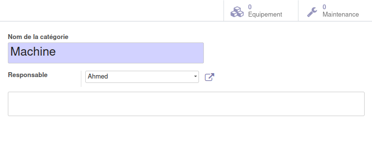
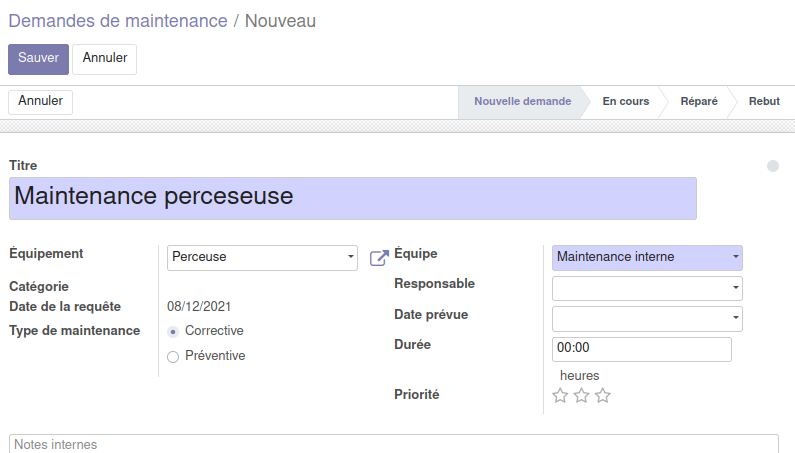
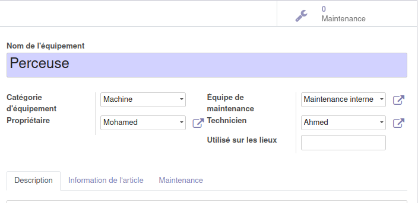

# Module Maintenance

Ce document illustre les différentes fonctionnalités du module **Maintenance** d'odoo 13 community.

## Présentation du module

Ce module est destiné à la gestion de la maintenance des équipements de l'entreprise. Il permet :
- d'automatiser la maintenance préventive pour garder la chaine de production toujours oprationnelle.
- d'organiser les demandes d'entretien avec des vues en Kanban ou en Calendrier.
- d'augmenter la performance des équipements avec une maintenance efficace et répondant aux exigences de la production.
- de disposer de tableaux de bord statistiques complets afin d'optimiser la performance globale.

## Configuration (admin)

Cette section, réservée aux **administrateurs** et **Gestionnaires de la maintenance**, permet de définir les paramètres généraux du module, tel que l'ajout d'une équipe de maintenance et des catégories d'équipements.

### Équipes de maintenance

Cette section permet de renseigner les informations nécessaires aux équipes de maintenance, notamment le nom de l'équipe et ses membres.

### Catégories d'équipement

Cette section permet de renseigner les informations nécessaires aux catégories d'équipements, tel que le nom et le resposnable. Dans cette même vue (boutons en haut à droite) l'utilisateur dispose de statistiques et d'un accès directes aux équipements et aux opérations de maintenance associés à cette catégorie.

## Tableau de bord 

Le tableau de Bord du module maintenance permet de disposer d'une vue globale de l'activé des équipes et offre des liens directs vers les demandes __**A faire**__ __**Non Programmée**__ et autres. 

## Maintenance 

Cette section permet de gérer les demandes de maintenance, ainsi que les calendriers y afférents. L'utilisateur peut, créer des demande de maintenance et renseigner toutes les informations y relatives, tel que l'équipement concerné, le type de maintenance __préventive/corrective__, l'équipe resposnable, ... 

Cette demande de maintenance, progresse par plusieurs état qui sont : **_Nouvelle demande_**, **_En cours_**, **_Réparé_** et **_Rebut_**. 

Une fois crées, les demandes de maintenances, peuvent être affichées sous forme de **Pipeline**, de **Calendrier** de **Graph** ou de **Calendrier.

## Equipements

L'équipement est l'élement principal de tout opération de maintenance et cette partie permet de renseigner toutes informations qui lui sont associés, tel que le nom, la catégorie, le propriétaire (opérateur), l'équipe de maintenance qui lui assicié, les lieux sur lesquels il est exploités, ...

D'autre informations sur l'équipements sont disponibles dans l'onglet __informations de l'article__, tel que le fournisseur, le modèle, le numéro de série, la date effective, ...

## Analyse

La partie analyse permet aux **Gestionnaires de la maintenance** de visualiser des vues synthétiques sous différentes formes (listes, tableau croisé ou graphes).

## Workflow

## Plus de détails

- [Site officiel d'odoo](https://www.odoo.com/fr_FR/app/maintenance).  

----
[Retour au sommaire](./odoo-deploy-guidelines-fr.md)